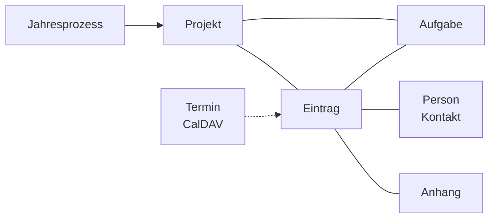

# Lastenheft – Schulleitungs-Journal-App

2026-09-20 · @Someone

## 1. Zielsetzung und Abgrenzung

Die App löst das bisherige Obsidian-Setup zur Organisation der Schulleitungsarbeit ab und bildet die Arbeitsweise direkt im Datenmodell ab, statt ein Universalwerkzeug zurechtzubiegen.

**Ausgangslage:** Obsidian mit Plugins — Journal mit durchklickbarer Tagesansicht, Notizen zu Meetings und wichtigen Telefonaten, manuell hineinkopierte Mails mit Datumszuordnung und Tags, To-Dos mit Fälligkeitsdatum, die auf der Tagesseite zusammenlaufen.

**Kernproblem:** Obsidian denkt in Dateien und Datumsnotizen. Schulleitungsarbeit spielt sich überwiegend in Vorgängen ab, die sich über Wochen ziehen und quer zu den Tagesnotizen liegen. Ein Kalender ließ sich nicht einbinden, der Mailimport bleibt Handarbeit.

**Ziel:** ein Werkzeug mit Tagescockpit als Einstieg, Projekten als Klammer über alle Inhalte, halbautomatischem Maileingang, lesender Kalenderanbindung an die bestehende Nextcloud und einem Schuljahresgedächtnis für wiederkehrende Prozesse.

**Nicht Ziel:** kein Ersatz für das Dienstpostfach, kein zweiter Kalender, keine Mehrbenutzeranwendung. Einzelplatzwerkzeug für die Schulleitung.

## 2. Rahmenbedingungen

Die App läuft als selbst gehostete Webanwendung auf vorhandener Infrastruktur (Ubuntu-Server, nginx, systemd) und orientiert sich am bewährten Aufbau bestehender Eigenentwicklungen.

| Aspekt | Festlegung |
| --- | --- |
| Technologie | Python-Webframework (Flask oder FastAPI), SQLite als Datenbank |
| Betrieb | Self-hosted, Deployment per systemd-Service hinter nginx |
| Nutzer | Einzelnutzer; einfache Authentifizierung, keine Rollenverwaltung |
| Endgeräte | Desktop (Hauptnutzung) und iPad — responsives Layout erforderlich |
| Externe Dienste | IMAP-Archivpostfach, Nextcloud-CalDAV (lesend) |
| Dateiablage | Mailanhänge im Dateisystem, Metadaten in der Datenbank |

Offene Entscheidung: ob die Anwendung auf dem privaten Server oder rein lokal auf dem Dienstgerät läuft — siehe Abschnitt 11.

## 3. Datenmodell

Zentrale Idee: Mail, Gesprächsprotokoll, Telefonnotiz und Journalabsatz sind derselbe Datentyp **Eintrag** mit unterschiedlicher Herkunft. Nur Aufgaben sind eigenständig, weil sie ein Fälligkeitsdatum und einen Erledigt-Status haben.

Ein Eintrag kann mehreren Projekten zugeordnet sein; eine Aufgabe hängt an einem Projekt, optional zusätzlich an dem Eintrag, aus dem sie entstanden ist.

| Entität | Wesentliche Felder |
| --- | --- |
| Eintrag | Datum, Uhrzeit, Typ (Mail ein/aus, Gespräch, Telefonat, Journal, Notiz), Titel, Text, Absender/Beteiligte, Projektzuordnungen, Tags, Anhänge |
| Projekt | Name, Beschreibung, Status (aktiv/abgeschlossen), Schuljahr, Vorlagenherkunft |
| Aufgabe | Text, Fälligkeitsdatum, Status, Projekt, Herkunftseintrag, Erledigungsdatum |
| Person | Name, Rolle/Institution, Mailadressen (für automatische Zuordnung) |
| Anhang | Dateiname, Pfad, MIME-Typ, Herkunftseintrag |
| Jahresprozess | Name, Zeitraumdefinition, Vorlagen-To-Dos, letzte Auslösung |
| Termin | Aus CalDAV gelesen, nicht persistiert (nur Cache) |

Tags bleiben als leichtgewichtige Querschnittsordnung neben den Projekten erhalten.

## 4. Tagescockpit (Homescreen)

Der Homescreen ist die Startseite der App und zeigt den aktuellen Tag. Vor- und Zurückblättern zu anderen Tagen muss möglich sein (wie das bisherige Obsidian-Journal).

Bereiche des Cockpits:

1. **Termine des Tages** — aus den Nextcloud-Kalendern gelesen, nach Kalender unterscheidbar (Abschnitt 9)
2. **Kommunikation** — alle an diesem Tag empfangenen und gesendeten Mails, getrennt dargestellt
3. **Gesprächsprotokolle und Telefonnotizen** des Tages
4. **Journal** — Freitextbereich: an welchen Projekten wurde gearbeitet, was wurde getan
5. **Aufgaben** in drei Gruppen: überfällig, heute fällig, fällig in den nächsten 14 Tagen

Aus jedem Bereich heraus muss sich eine neue Aufgabe oder ein neuer Eintrag anlegen lassen, ohne die Seite zu verlassen. Ein Eingangsstapel zeigt zusätzlich alle noch keinem Projekt zugeordneten Mails.

## 5. Maileingang über ein Archivpostfach

Die App ruft **nicht** das reguläre Dienstpostfach ab. Stattdessen wird ein eigenes IMAP-Postfach eingerichtet, das gezielt befüllt wird:

- **Eingehende Mails**, die archiviert werden sollen, werden dorthin weitergeleitet.
- **Eigene ausgehende Mails** werden per BCC an dieses Postfach mitgeschickt. Sie kommen dadurch im Original an — Absender, Datum, Betreff und Anhänge bleiben unverändert erhalten.

Die App ruft das Postfach periodisch per IMAP ab, parst jede Nachricht, legt Anhänge im Dateisystem ab und erzeugt einen Eintrag mit Status „unsortiert".

**Richtungserkennung:** Steht die eigene Adresse im Von-Feld, ist es eine ausgehende Mail, sonst eine eingehende. Keine manuelle Markierung nötig.

**Weiterleitungen parsen:** Beim klassischen Weiterleiten geht der Originalabsender in die Header verloren und steckt nur noch im Text. Zu unterstützen sind die beiden genutzten Clients:

| Client | Erkennungsmuster |
| --- | --- |
| Thunderbird (Desktop) | `-------- Weitergeleitete Nachricht --------` mit Feldern Betreff, Datum, Von, An |
| Apple Mail (iOS/iPad) | `Anfang der weitergeleiteten Nachricht:` mit entsprechenden Feldern |

Der Parser ist Heuristik. Wird der Block nicht sicher erkannt, bleiben die Felder leer und sind in der Oberfläche nachtragbar — kein Abbruch, keine falschen Daten.

Empfehlung: In Thunderbird „Weiterleiten als Anhang" als Standard einstellen. Dann liegt die Original-Mail als `.eml` bei und muss nicht geparst werden. Am iPad steht diese Option nicht zur Verfügung.

**Betreffsteuerung:** Tags oder eine Projektzuordnung können im Betreff in eckigen Klammern mitgegeben werden (z. B. `[Schulfest]`) und werden beim Import direkt ausgewertet.

**Zugangsschutz:** Die Adresse des Archivpostfachs wird nicht veröffentlicht; zusätzlich Absenderfilter — nur Mails von den eigenen bekannten Adressen werden verarbeitet, alles andere wird verworfen.

## 6. Einträge: Protokolle, Notizen, Journal

Alle manuell erfassten Inhalte nutzen dieselbe Eintragsmaske, unterschieden nur durch den Typ.

- **Gesprächsprotokoll** — Datum, Beteiligte, Anlass, Text; typischerweise aus einem Termin heraus angelegt
- **Telefonnotiz** — schnelle Erfassung mit Gesprächspartner, Uhrzeit und Stichpunkten
- **Journaleintrag** — Freitext zum Tag: woran gearbeitet wurde und was konkret getan wurde
- **Notiz** — alles Übrige

Anforderungen an die Erfassung: sehr schnell erreichbar (Tastenkürzel oder fester Button), Markdown als Textformat, Projektzuordnung und Tags direkt in der Maske, Aufgabe aus dem Text heraus anlegbar.

Aus einem Kalendertermin heraus soll sich ein Gesprächsprotokoll erzeugen lassen, das Datum und Titel des Termins übernimmt.

## 7. Projekte und Vorgänge

Das Projekt ist die Klammer über alle Inhalte und der wesentliche Mehrwert gegenüber Obsidian. Die Projektseite zeigt gebündelt:

- alle zugeordneten Mails, ein- und ausgehend
- alle Gesprächsprotokolle, Telefonnotizen und Journalbezüge, chronologisch
- alle offenen und erledigten Aufgaben zum Projekt
- alle Anhänge an einer Stelle

Beispiel: Beim Öffnen des Projekts „Schulfest" ist sofort sichtbar, welche Mails dazu verschickt wurden, welche Besprechungen stattfanden und was noch offen ist.

**Zuordnung:** Ein Eintrag kann mehreren Projekten zugeordnet werden. Beim Mailimport schlägt die App ein Projekt vor — anhand des Betreffs, einer Kennung in eckigen Klammern oder früherer Zuordnungen desselben Absenders oder Betreffs.

**Archivierung:** Projekte haben den Status aktiv oder abgeschlossen. Abgeschlossene Projekte verschwinden aus den Standardlisten, bleiben aber vollständig durchsuchbar. Bei wiederkehrenden Vorhaben wie dem Schulfest lässt sich so im Folgejahr nachsehen, wie es beim letzten Mal lief.

Beim Abschließen fragt die App, ob das Projekt als Vorlage für einen Jahresprozess übernommen werden soll (Abschnitt 10).

## 8. Aufgabenverwaltung

Die Aufgabenlogik bildet nach, was im Obsidian-Setup bereits gut funktioniert und beibehalten werden soll.

- Aufgaben sind **von jeder Unterseite aus** anlegbar — aus einem Eintrag, einem Projekt, einem Termin oder direkt vom Cockpit.
- Jede Aufgabe kann ein Fälligkeitsdatum tragen; Aufgaben ohne Datum sind zulässig und erscheinen in einer eigenen Liste.
- Wird eine Aufgabe aus einem Kontext heraus angelegt, erbt sie dessen Projektzuordnung automatisch.

Die Cockpit-Ansicht gruppiert nach Fälligkeit:

| Gruppe | Definition |
| --- | --- |
| Überfällig | Fälligkeitsdatum liegt vor heute, nicht erledigt |
| Heute fällig | Fälligkeitsdatum ist der angezeigte Tag |
| Demnächst | Fälligkeit in den kommenden 14 Tagen |

Erledigte Aufgaben werden mit Erledigungsdatum gespeichert und bleiben auf der Projektseite sichtbar.

## 9. Kalenderanbindung (CalDAV)

Dienstliche Termine werden weiterhin ausschließlich in der bestehenden Nextcloud gepflegt. Die App bindet die Kalender **rein lesend** über CalDAV an — kein Parallelkalender, keine Doppelpflege.

Anforderungen:

- Mehrere Kalender gleichzeitig anbindbar, in der Oberfläche unterscheidbar (z. B. farblich)
- Termine des angezeigten Tages erscheinen im Cockpit
- Umsetzung in Python mit der `caldav`-Bibliothek
- Zugangsdaten über einen Nextcloud-App-Token, nicht über das Hauptpasswort
- Lokaler Cache, damit die Ansicht bei Netzproblemen nutzbar bleibt

Aus einem Termin heraus lässt sich ein Gesprächsprotokoll anlegen, das Datum und Titel übernimmt.

## 10. Wiederkehrende Schuljahresprozesse

An der Schule gibt es Abläufe, die nur einmal im Schuljahr anfallen und im Alltagsgeschäft leicht untergehen. Die App soll als Schuljahresgedächtnis dienen.

**Besonderheit:** Diese Prozesse haben im Vorhinein oft kein konkretes Datum, sondern nur einen Zeitraum. Beispiel Martinszug: Der Zug findet im Herbst statt, die Vorbereitungen müssen aber bereits Anfang September beginnen.

Deshalb wird ein Jahresprozess nicht an ein festes Datum gebunden, sondern an eine Zeitraumverankerung, etwa „erste Septemberwoche" oder „Mitte Januar".

Ablauf:

1. Ein Jahresprozess wird einmal angelegt, mit Zeitraum und einer Liste typischer To-Dos.
2. Erreicht der Zeitraum den aktuellen Tag, erscheint im Cockpit eine Erinnerung.
3. Auf Bestätigung hin legt die App ein Projekt für das laufende Schuljahr an und erzeugt die hinterlegten To-Dos.
4. Beim Abschließen eines Projekts kann dessen Aufgabenliste als Vorlage für das Folgejahr übernommen werden.

So wächst das Schuljahresgerüst im laufenden Betrieb, ohne dass es vorab vollständig modelliert werden muss.

## 11. Datenschutz und Sicherheit

In der App landen zwangsläufig sensible personenbezogene Daten: Schülerinnen und Schüler, Förderbedarfe, Personalangelegenheiten, Elternkonflikte. Diese Frage ist vor der Architekturentscheidung zu klären, weil sie bestimmt, **wo** die Anwendung läuft.

Zu klären mit Schulträger und Datenschutzbeauftragter/m:

- Zulässigkeit der Verarbeitung außerhalb dienstlicher Systeme (in NRW nur eingeschränkt bzw. mit Genehmigung)
- Betrieb auf privatem Server versus rein lokalem Betrieb auf dem Dienstgerät
- Erforderliche technische und organisatorische Maßnahmen

Der Hinweis gilt gleichermaßen für das bestehende Obsidian-Setup, je nachdem wo der Vault liegt.

Technische Mindestanforderungen unabhängig vom Ergebnis:

- Verschlüsselung der Datenbank und der Anhänge im Ruhezustand
- Zugriff ausschließlich über HTTPS, Authentifizierung mit starkem Passwort und zweitem Faktor
- Automatisiertes, verschlüsseltes Backup
- Kein Zugriff von außen ohne VPN oder gleichwertigen Schutz, falls serverseitig betrieben
- Löschkonzept: definierte Aufbewahrungsfristen je Eintragstyp

Diese Einschätzung ersetzt keine Rechtsberatung.

## 12. Migration und erster Ausbaustand

**Migration aus Obsidian:** Der bestehende Vault wird per Python-Skript eingelesen — Markdown-Dateien mit Frontmatter und Tags werden in die Datenbank überführt. Tagesnotizen werden zu Journaleinträgen, bestehende Tags bleiben erhalten, offene To-Dos werden als Aufgaben mit Fälligkeitsdatum übernommen.

**Erster Ausbaustand (MVP):**

- [ ] Datenmodell und Datenbankschema
- [ ] Tagescockpit mit Blättern, Journalbereich und Einträgen
- [ ] Aufgaben mit Fälligkeitsgruppen
- [ ] Projekte mit Zuordnung und Archivierung
- [ ] Volltextsuche über alle Einträge

**Zweiter Schritt:**

- [ ] IMAP-Abruf, Mailparsing und Anhangsablage
- [ ] Weiterleitungsparser für Thunderbird und Apple Mail
- [ ] CalDAV-Anbindung
- [ ] Jahresprozesse mit Erinnerungen
- [ ] Obsidian-Import

Offene Punkte: Ablageort der Anwendung (siehe Abschnitt 11) sowie die Frage, ob Personen als eigene Objekte bereits im MVP geführt werden oder zunächst als Freitextfeld genügen.
