# Ein Ort für den Überblick: Das Schulleitungsjournal im Grundschulalltag

**Mails einordnen, Gespräche festhalten, Aufgaben verfolgen und Besprechungen vorbereiten – wie SL-Journal die vielen kleinen und großen Themen einer Grundschulleitung miteinander verbindet.**

Ein Anruf kurz vor Unterrichtsbeginn. Eine Rückmeldung aus der OGS. Die Frage, ob der Mehrzweckraum für die Theater-AG frei ist. Dazwischen ein Gespräch über Leseförderung und die Vorbereitung der nächsten Konferenz. Vieles davon dauert nur wenige Minuten. Trotzdem entstehen Informationen, Absprachen und Aufgaben, die auch einige Tage später noch verfügbar sein müssen.

Häufig verteilen sich diese Dinge auf das Mailprogramm, einen Kalender, handschriftliche Notizen und verschiedene Aufgabenlisten. Die Schwierigkeit beginnt beim Wiederfinden: Was hatten wir vereinbart? Welche Unterlage gehört dazu? Habe ich den Punkt schon für das Gespräch mit der Konrektorin vorgemerkt?

Das **Schulleitungsjournal**, kurz **SL-Journal**, setzt an diesen Verbindungen an. Es ist eine selbst betriebene Webanwendung für den persönlichen Arbeitsbereich einer Schulleitung. Einträge, Aufgaben, Kontakte, Projekte und Vorgänge lassen sich miteinander verknüpfen. Dadurch kann aus einzelnen Informationen eine nachvollziehbare Geschichte werden: von der ersten Anfrage bis zum Abschluss.

Die folgende Vorstellung begleitet eine fiktive Grundschule durch typische Arbeitssituationen. Alle Screenshots stammen aus der tatsächlichen Oberfläche mit eigens erzeugten Beispieldaten. Namen, Schule, Kontakte und Inhalte sind frei erfunden; die Datumsangaben dienen der Demonstration.

## 1. Am Morgen: Was steht an, was braucht Aufmerksamkeit?

Nach der Anmeldung öffnet sich das **Tagescockpit**. Hier kommen mehrere Perspektiven zusammen: Termine, offene Aufgaben, Wiedervorlagen und die Einträge des ausgewählten Tages. Eine kompakte Datumsnavigation führt zu früheren oder späteren Tagen und wieder zurück zu heute.

Die Aufgaben sind nach ihrer Fälligkeit gegliedert. Überfällige Punkte stehen ebenso im Blick wie heute fällige Aufgaben und das, was in den nächsten zwei Wochen ansteht. Aufgaben ohne Datum bleiben über einen eigenen Zugang erreichbar. Vorgänge mit einer fälligen Wiedervorlage erinnern daran, dass eine Rückmeldung oder ein nächster Schritt aussteht.

Das ist beispielsweise hilfreich, wenn die Abholsituation noch mit der OGS abgestimmt werden muss und gleichzeitig die Materialplanung für ein Fest läuft. Beide Themen erscheinen dort, wo sie für den Tag relevant sind. Die Zahl unbearbeiteter Mails macht zusätzlich sichtbar, was noch eingeordnet werden sollte.

Wer Nextcloud verwendet, kann geladene Kalendertermine im Cockpit anzeigen lassen. Die Kalenderanbindung liest Termine; die eigentliche Terminverwaltung bleibt in Nextcloud. Ohne diese Verbindung lässt sich das Journal ebenfalls nutzen.

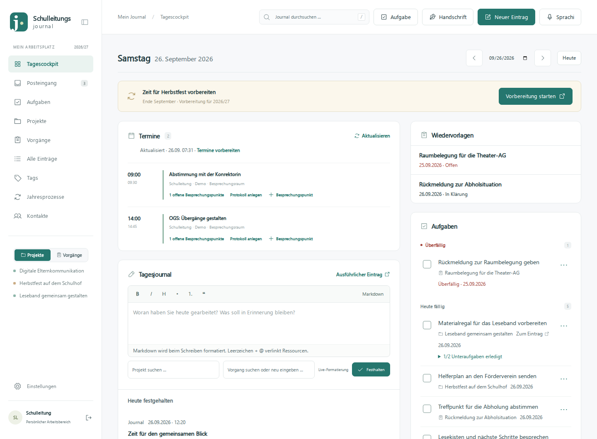

*Das Tagescockpit bündelt Termine, Aufgaben und Wiedervorlagen. Links beginnt direkt die Erfassung des Tagesjournals.*

## 2. Zwischen zwei Terminen: Wichtiges schnell festhalten

Nicht jede Information braucht sofort eine ausführliche Dokumentation. Für einen kurzen Gedanken oder einen Tagesrückblick gibt es das **Tagesjournal direkt im Cockpit**. Text schreiben, bei Bedarf zuordnen, festhalten. Bereits gespeicherte Einträge stehen optisch getrennt darunter unter „Heute festgehalten“.

Für ausführlichere Inhalte öffnet **Neuer Eintrag** eine eigene Eingabemaske. Zur Auswahl stehen unter anderem Mail, Gespräch, Telefonat, Journal, Notiz und Protokoll. Titel, Datum, Uhrzeit und Beteiligte geben dem Inhalt einen Rahmen. Projekte, Vorgänge und Tags helfen bei der späteren Einordnung.

Texte können direkt beim Schreiben formatiert werden: mit Überschriften, Listen, Hervorhebungen und Zitaten. Wer Markdown kennt, verwendet die entsprechenden Schreibweisen. Wer diese Syntax nicht nutzen möchte, kann die wichtigsten Formatierungen über die Werkzeugleiste auswählen. Aus einer Gesprächsnotiz wird so mit wenig Aufwand eine lesbare Zusammenfassung mit klaren nächsten Schritten.

Für die Praxis bietet sich eine einfache Gewohnheit an: Nach einem wichtigen Telefonat kurz Anlass, Ergebnis und nächste Handlung notieren. Ein solcher Eintrag muss nicht lang sein, um später eine große Hilfe zu sein.

## 3. Kommunikation einordnen: Mails mit ihrem Zusammenhang aufbewahren

Viele Leitungsthemen beginnen mit einer E-Mail. Im Journal zeigen die Mailkarten deshalb nicht nur den Betreff, sondern auch die Beteiligten, Zuordnungen und einen **kurzen Ausschnitt des Inhalts**. Eingegangene und gesendete Nachrichten sind unterscheidbar. Die Vorschau erleichtert es, eine Mail zu erkennen, ohne jede Nachricht einzeln öffnen zu müssen.

Für den Import kann ein eigenes Archivpostfach eingerichtet werden. Ausgewählte eingegangene Mails werden dorthin weitergeleitet; ausgehende Nachrichten können per BCC archiviert werden. Damit lässt sich gezielt entscheiden, welche Kommunikation im Journal ihren Platz haben soll. Ein vorhandenes Mailprogramm bleibt weiterhin für den eigentlichen Mailverkehr zuständig.

Bei unterstützten Weiterleitungsformaten versucht die App, ursprünglichen Betreff, Absender und Inhalt herauszulösen. Erkennbare Weiterleitungsbestandteile werden bereinigt. Wo die Originalangaben nicht zuverlässig ermittelt werden können, fordert die App zur Prüfung auf. Die Originalmail und Anhänge bleiben als Grundlage erhalten.

Eine importierte Mail gilt als eingeordnet, wenn sie einem Projekt oder Vorgang zugewiesen oder mit Tags versehen wurde. So muss aus einer einzelnen Information nicht künstlich ein Projekt werden. Die Einladung der Stadtbücherei kann etwa einfach den Tag „Leseförderung“ bekommen. Offene Zuordnungsvorschläge müssen zunächst übernommen werden.

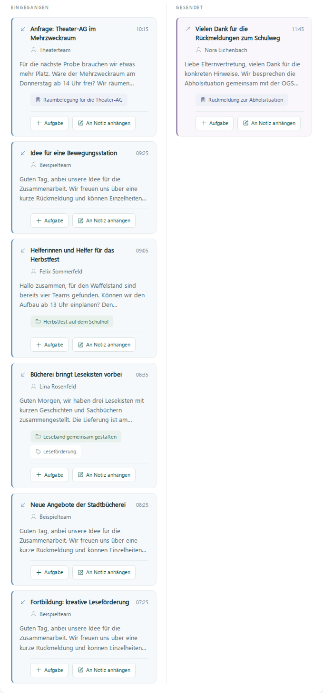

*Die Inhaltsvorschau macht die Mailkarten aussagekräftiger. Aufgaben und Verknüpfungen lassen sich direkt von der Karte aus anstoßen.*

## 4. Ordnung mit Augenmaß: Projekte, Vorgänge und Tags

Im Schulalltag haben Themen unterschiedliche Größen. Die App bietet deshalb mehrere Formen der Einordnung, die sich ergänzen.

| Einordnung | Wofür sie sich eignet | Beispiel |
| --- | --- | --- |
| **Projekt** | Ein geplantes Vorhaben mit mehreren Schritten und einer längeren Entwicklung | Ein Leseband einführen, ein Schulfest organisieren |
| **Vorgang** | Ein konkretes Anliegen, dessen Verlauf sich erst ergibt | Eine Elternrückmeldung klären, die Raumnutzung abstimmen |
| **Tag** | Ein Stichwort, das Inhalte über mehrere Themen hinweg verbindet | Ganztag, Kollegium, Leseförderung |

### Vorgänge: Die kleinen Baustellen ernst nehmen

Eine Rückfrage zur Abholung ist zunächst vielleicht nur ein Gespräch. Dann folgt eine Mail, eine Abstimmung mit der OGS und schließlich eine neue Vereinbarung. Als **Vorgang** werden diese Schritte zusammengeführt, ohne dass vorher ein vollständiger Projektplan existieren muss.

Ein Vorgang hat einen Titel, Notizen, einen Status und auf Wunsch eine Wiedervorlage. „Offen“, „In Klärung“ und „Erledigt“ machen den Bearbeitungsstand sichtbar. Verknüpfte Einträge und Aufgaben dokumentieren, was bisher geschehen ist und was noch fehlt. Die Wiedervorlage bringt das Anliegen zum passenden Zeitpunkt zurück ins Cockpit.

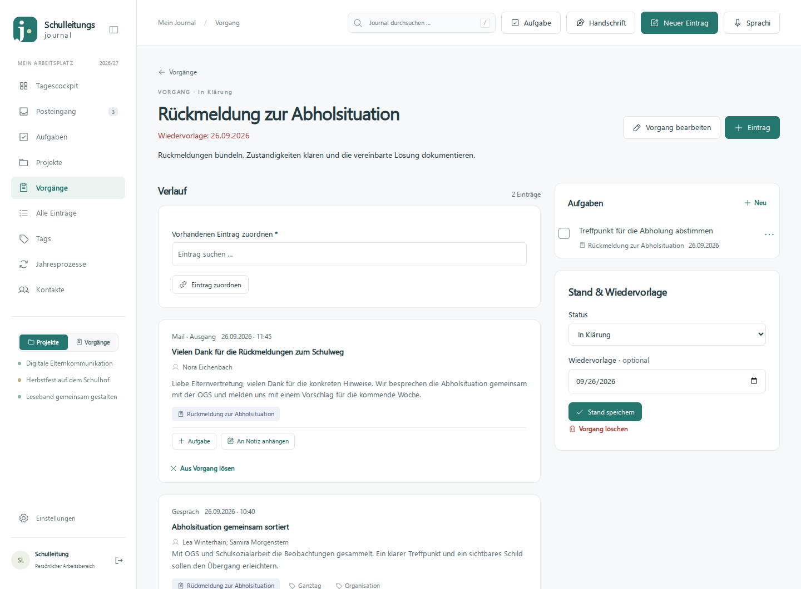

*Ein Vorgang sammelt die Geschichte eines konkreten Anliegens – hier die Abstimmung zur Abholsituation.*

### Projekte: Entwicklungen über längere Zeit verfolgen

Ein Projekt wie „Leseband gemeinsam gestalten“ verbindet die pädagogische Planung mit ihrer Umsetzung. Gesprächsnotizen, Mails, Protokolle und Aufgaben erscheinen im Projektzusammenhang. So lässt sich später nachvollziehen, welche Entscheidungen gefallen sind und welche Erfahrungen die Teams gesammelt haben.

Einträge können mehreren Projekten zugeordnet werden. Das ist sinnvoll, wenn etwa eine Büchereikooperation sowohl die Leseförderung als auch ein Schulfest betrifft. Abgeschlossene Projekte bleiben auffindbar und können als Erfahrungsschatz für spätere Vorhaben dienen.

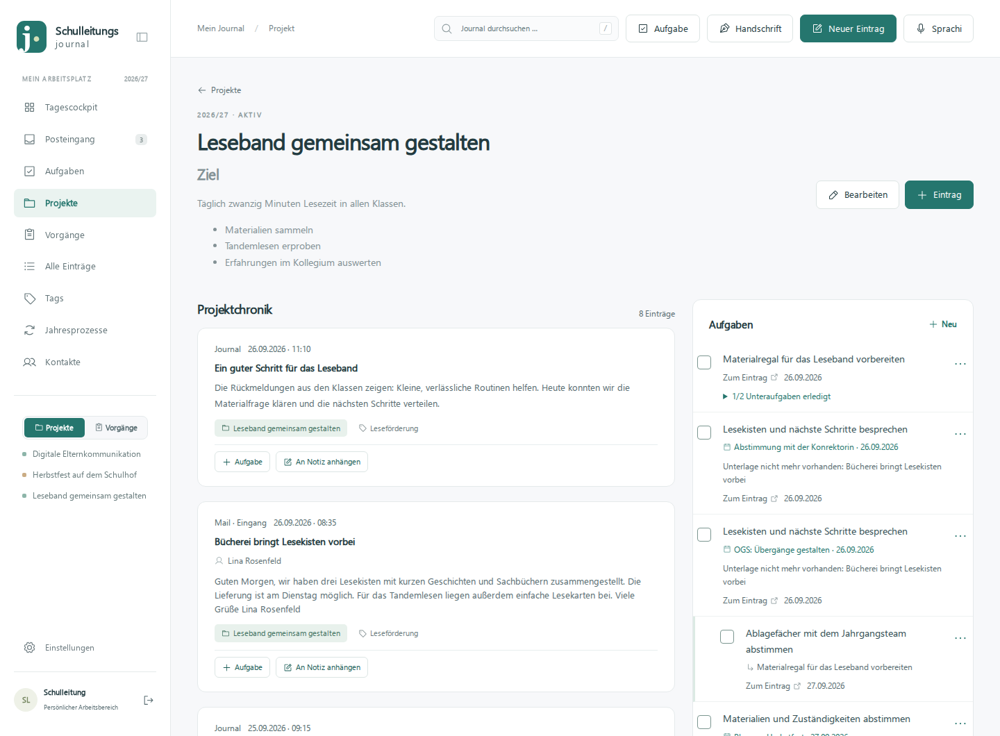

*Die Projektansicht verbindet Zielbeschreibung, Chronik und Aufgaben. Informationen müssen dafür nicht noch einmal abgeschrieben werden.*

Bei Zuordnungen helfen Vorschläge während der Eingabe. Ein neuer Projekt- oder Vorgangsname kann zunächst als Vorschlag gesammelt werden. Das erlaubt, einen Gedanken zügig festzuhalten und die endgültige Struktur später zu ordnen. Über die Seitenleiste ist wahlweise ein schneller Zugang zu aktiven Projekten oder offenen Vorgängen möglich.

## 5. Aus Informationen werden nächste Schritte

Eine Notiz allein erledigt noch keine Aufgabe. Deshalb lassen sich **Aufgaben direkt mit ihrem Ursprung verknüpfen**. Aus einer Mail, einem Gespräch oder einem Protokoll können mehrere Aufgaben entstehen. Auch eine markierte Textstelle kann als Ausgangspunkt dienen.

Im Protokoll zur Leseförderung steht beispielsweise, dass Material gesammelt, ein Regal vorbereitet und ein Rückmeldetermin vereinbart werden soll. Daraus können drei Aufgaben mit eigenen Fälligkeiten werden. Über den Herkunftsverweis bleibt erkennbar, aus welcher Besprechung sie stammen.

Für größere Arbeitsschritte gibt es **Unteraufgaben**. „Materialregal vorbereiten“ lässt sich etwa in „Beschriftungen drucken“ und „Ablagefächer abstimmen“ unterteilen. Die Aufgabe wird dadurch konkreter, und Teilfortschritte bleiben sichtbar.

### Wiederkehrendes einmal vorbereiten

Viele Tätigkeiten kehren regelmäßig zurück: die Wochenpost, eine Statistik, eine Materialkontrolle oder die Vorbereitung einer monatlichen Besprechung. Aufgabenserien können wöchentlich, monatlich, quartalsweise oder zu einzeln gewählten Terminen angelegt werden.

Platzhalter passen den Titel an die jeweilige Fälligkeit an. Aus **„Wochenpost KW{KW} vorbereiten“** wird eine Aufgabe mit der passenden Kalenderwoche. Auch Monat, Quartal und Jahr können im Titel auftauchen. Neue Termine der Serie werden beim Öffnen der App bis zu einem begrenzten Zeitraum im Voraus erzeugt; sie müssen nicht einzeln abgeschrieben werden.

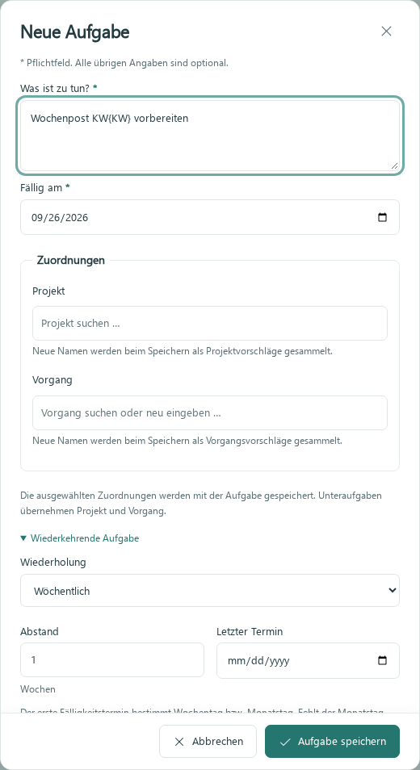

*Wiederkehrende Aufgaben verbinden eine Titelvorlage mit einem Rhythmus. Die Vorschau zeigt den daraus entstehenden Aufgabentitel.*

## 6. Besprechungen vorbereiten, bevor das Protokoll existiert

Eine besonders praktische Situation: Die Stadtbücherei hat Lesekisten angeboten. Darüber soll im nächsten Gespräch mit der Konrektorin gesprochen werden. Der Termin steht bereits im Nextcloud-Kalender, ein Protokoll ist noch nicht angelegt.

Mit **Für Termin vormerken** lässt sich aus der Mail ein Besprechungspunkt für genau diesen Termin erstellen. Das funktioniert auch mit einem Anhang oder einem verknüpften Nextcloud-Dokument. Die Aufgabe verweist auf die Quelle; die Unterlage muss nicht an einen weiteren Ort kopiert werden.

In der Terminübersicht sind die gesammelten Punkte sichtbar. Vor dem Gespräch lässt sich prüfen, was besprochen werden soll. Währenddessen können Punkte abgehakt oder ergänzt werden. Damit wird der Kalendertermin zu einem Zugang zur Vorbereitung, obwohl die Terminverwaltung selbst weiterhin in Nextcloud stattfindet.

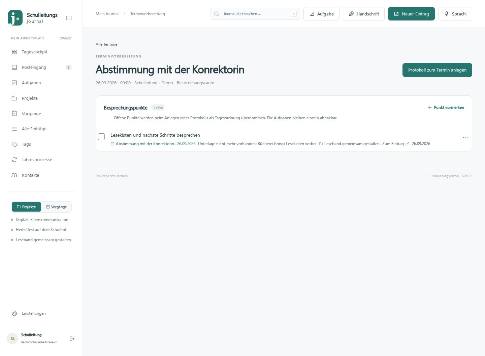

*Ein Besprechungspunkt ist bereits mit dem Termin und seiner Unterlage verbunden. Ein Protokoll muss dafür noch nicht existieren.*

## 7. Protokolle: Tagesordnung, Gesprächsverlauf und Beschlüsse trennen

Für Konferenzen, Steuergruppen und andere Sitzungen gibt es den Eintragstyp **Protokoll**. Er unterscheidet drei Bereiche: Tagesordnung, Protokolltext und Beschlüsse. Alle drei lassen sich formatieren und mit anderen Ressourcen verlinken.

Diese Trennung erleichtert das spätere Lesen. Wer eine Entscheidung sucht, muss nicht zuerst den gesamten Gesprächsverlauf durchgehen. Gleichzeitig bleiben Beteiligte, Themenzuordnungen und daraus entstandene Aufgaben mit dem Protokoll verbunden.

Aus einem vorbereiteten Termin kann ein Protokoll angelegt werden. Die zu diesem Zeitpunkt offenen Besprechungspunkte werden als Tagesordnung übernommen. Bestehende Terminzuordnungen werden berücksichtigt; bei passenden bereits vorhandenen Protokollen wird deren Wiederverwendung angeboten beziehungsweise das zugeordnete Protokoll geöffnet. So entstehen nicht bei jedem Klick neue Fassungen derselben Sitzung.

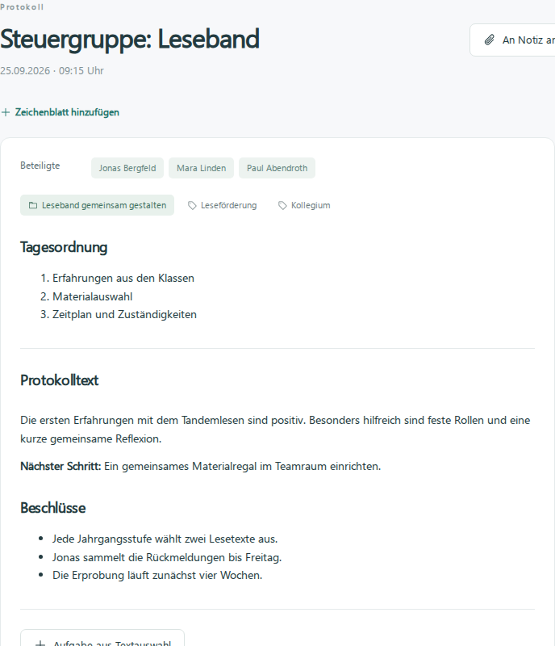

*Tagesordnung, Verlauf und Beschlüsse sind getrennt lesbar. Das Beispiel dokumentiert die nächsten Schritte für das Leseband.*

## 8. Unterlagen dort lassen, wo sie bereits liegen

Präsentationen, Konzepte und Tabellen liegen häufig schon in Nextcloud. Das Journal kann diese Dateien **verknüpfen**, statt eine weitere dauerhafte Ablage zu verlangen. Bei eingerichteter Verbindung lassen sich Dateien über einen Dateibrowser auswählen oder anhand ihres Namens suchen. Einen Link von Hand einzufügen bleibt ebenfalls möglich.

Dateien können Einträgen und Projekten zugeordnet werden. Eine Präsentation zur Leseförderung ist damit aus dem Protokoll erreichbar; ein Helferplan hängt beim Schulfestprojekt. Bei unterstützten Dateien bietet das Journal eine Vorschau und einen eigenen Betrachter. PDFs sind seitenweise lesbar, Bilder werden angezeigt. Für die Umwandlung von Office-Dokumenten braucht die Installation zusätzliche Software wie LibreOffice.

Die Nextcloud-Anbindung liest die Dateien. Für die Anzeige kann ein zeitlich begrenzter verschlüsselter Zwischenspeicher entstehen. Wer das Original bearbeiten möchte, öffnet es in Nextcloud. Eine Verbindung und passende Zugriffsrechte sind für diesen Komfort erforderlich.

Auch hochgeladene PDF-Anhänge lassen sich in einem Vorschaufenster betrachten. Am Rechner genügt dafür bei entsprechenden Karten das Zeigen mit der Maus; eine Vorschau-Schaltfläche ermöglicht die gezielte Bedienung. So kann ein kurzer Blick auf die Unterlage reichen, bevor man sie vollständig öffnet.

## 9. Kontakte und Verknüpfungen: Wissen wieder zusammenbringen

Wer war noch die Ansprechperson im Medienzentrum? Welche Kontakte gehören zum Schulträger? Die Kontaktverwaltung trennt **Name, Rolle und Institution** und ergänzt Mailadressen sowie eine Telefonnummer. Nach Institutionen kann gefiltert werden. Die Rolle „Fachberatung Medien“ bleibt damit von der zugehörigen Einrichtung unterscheidbar.

Beim Eintragen von Beteiligten helfen Autovervollständigungen. Unbekannte Namen werden als Kontaktvorschläge gesammelt und können später in Ruhe übernommen werden. Auch aus importierten Mails können Vorschläge entstehen. So wächst der Bestand aus der tatsächlichen Arbeit heraus.

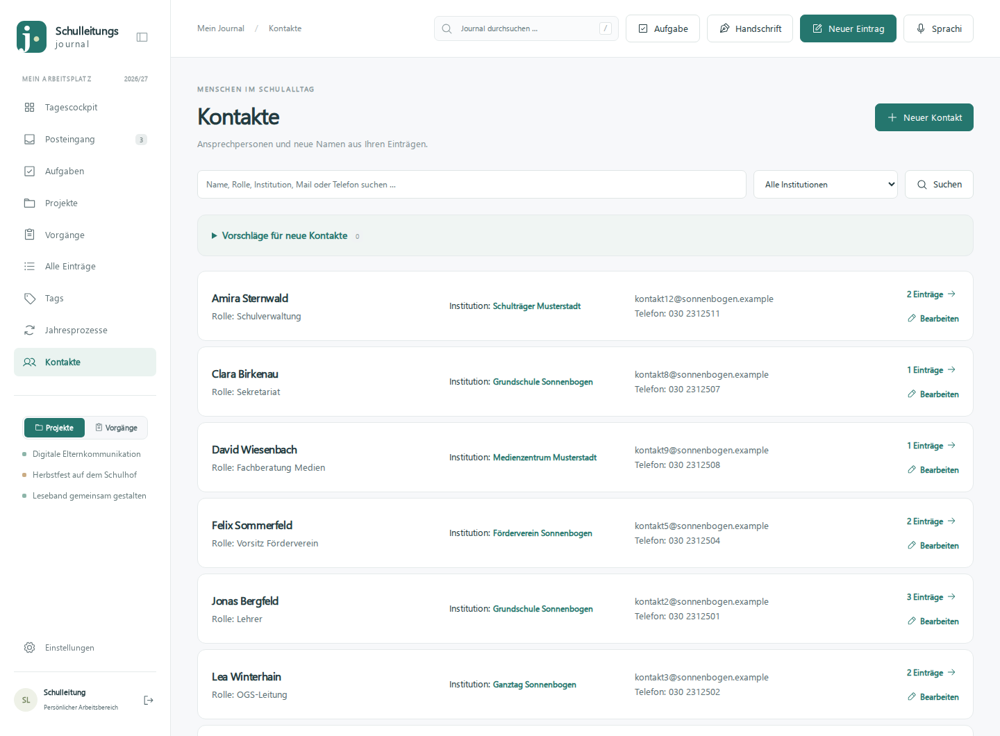

*Kontakte werden mit ihrer Rolle und Institution geführt. Das erleichtert die Suche nach Ansprechpersonen in einer bestimmten Einrichtung.*

Verbindungen lassen sich außerdem direkt im Text setzen. Nach einem Leerzeichen und **@** werden vorhandene Ressourcen vorgeschlagen, etwa ein Kontakt, Projekt oder Protokoll. Das Leerzeichen vor dem Zeichen verhindert, dass die Vorschlagsliste mitten in einer Mailadresse aufspringt. Eine Notiz kann so unmittelbar zu der Besprechung führen, auf die sie sich bezieht.

### Die Wochenpost schon im Lauf der Woche sammeln

Die Schaltfläche **An Notiz anhängen** unterstützt eine weitere typische Aufgabe: Inhalte für die nächste Wochenpost zusammentragen. Eine hilfreiche Mail kann an „Wochenpost KW …“ angehängt werden, auch wenn diese Notiz noch nicht existiert. Bei einem neuen Namen wird die Notiz angelegt.

Die Quellen bleiben an ihrem Platz und werden verknüpft. In der Notiz stehen dann die gesammelten Ressourcen bereit, während darüber der eigentliche Text der Wochenpost entstehen kann. Dasselbe Prinzip eignet sich für eine Konferenzvorbereitung oder eine Sammlung von Ideen für den pädagogischen Tag.

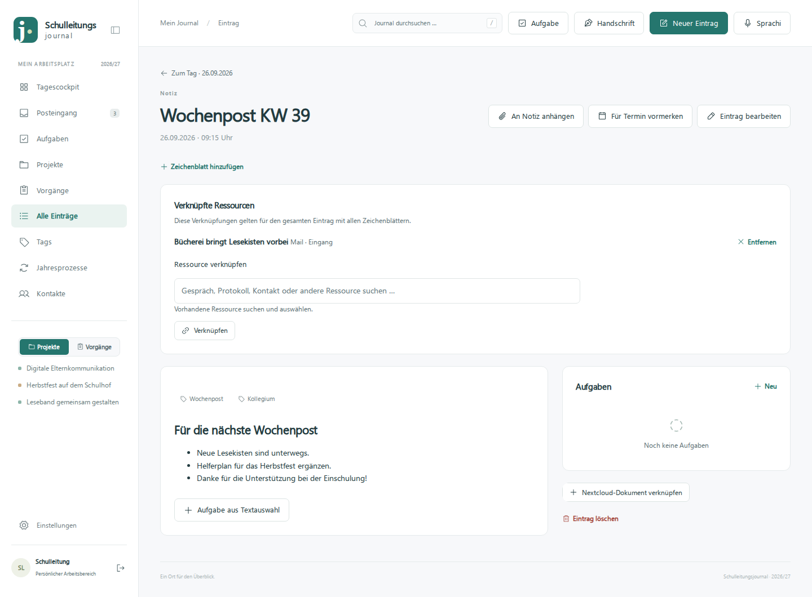

*Eine Notiz kann zugleich Textentwurf und Sammlung zugehöriger Quellen sein – hier für die nächste Wochenpost.*

## 10. Schreiben, zeichnen oder sprechen

Nicht jede Situation passt zur Tastatur. Mit **Handschrift** öffnet sich ein Zeichenbereich auf Basis von Excalidraw. Dort sind freie Stiftnotizen ebenso möglich wie Formen, Pfeile, Text und einfache Skizzen. Das kann bei einer Raumplanung, einem kurzen Austausch am Tisch oder einer visuellen Ideensammlung hilfreich sein.

Ein Eintrag kann mehrere Zeichenblätter enthalten. Die Zuordnung zu Projekten und Tags sowie die Verknüpfung mit anderen Ressourcen erfolgt am Eintrag. Die Zeichnung muss dadurch nicht außerhalb der sonstigen Dokumentation bleiben. Eine automatische Speicherung unterstützt das Mitschreiben; der sichtbare Speicherstatus zeigt den Stand an. Wie gut Stifteingabe und Handballenerkennung funktionieren, hängt auch vom verwendeten Gerät und Browser ab.

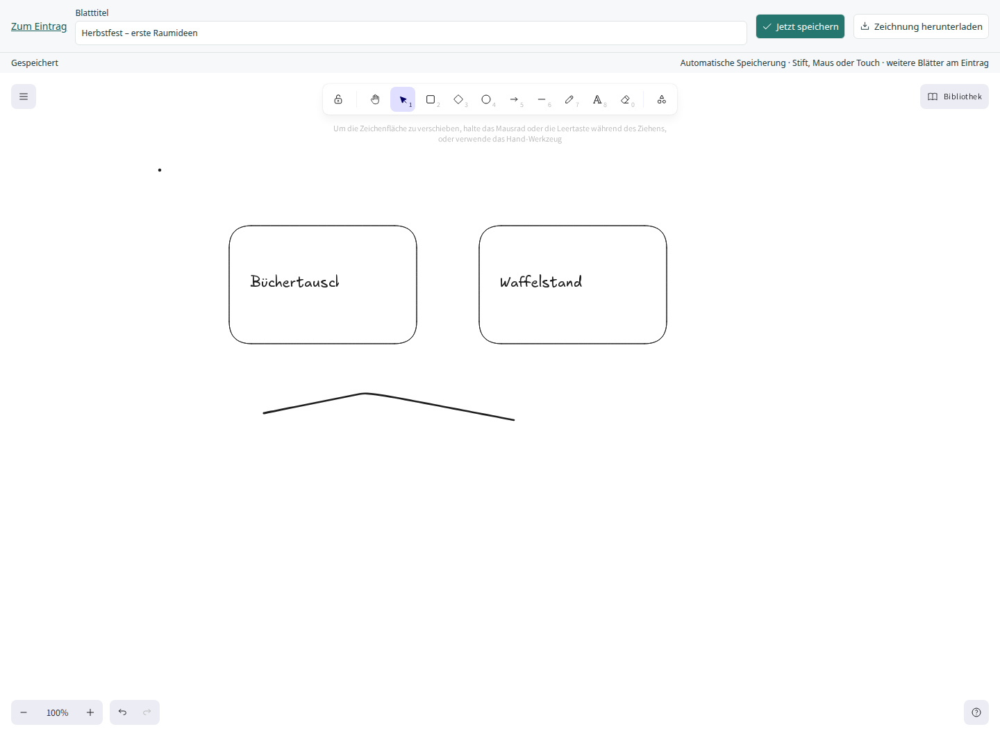

*Der Zeichenbereich eignet sich für Handschrift und Skizzen. Das Beispiel hält erste Raumideen für das Herbstfest fest.*

Für eine kurze gesprochene Gedächtnisstütze gibt es **Sprachi**. Die Aufnahme wird gestartet, gestoppt und kann vor dem Speichern angehört werden. Anschließend landet sie als Audio-Anhang eines Journaleintrags beim heutigen Tag. Sie lässt sich direkt im Journal abspielen.

Gedacht ist das beispielsweise für eine eigene Zusammenfassung nach einem Termin. Es handelt sich um eine Audioaufnahme, nicht um eine automatische Verschriftlichung oder KI-Zusammenfassung. Mikrofonfreigabe und eine vertrauenswürdige HTTPS-Verbindung müssen auf dem jeweiligen Gerät eingerichtet sein.

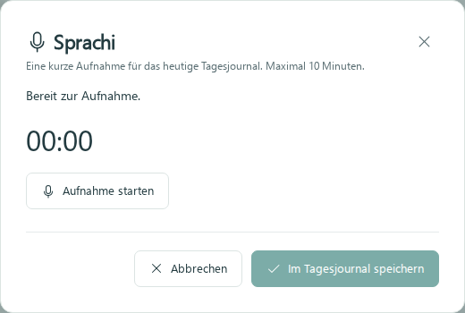

*Sprachi speichert eine gesprochene Notiz im heutigen Tagesjournal. Der Screenshot zeigt den Dialog vor Beginn einer Aufnahme.*

## 11. Wiederfinden statt nochmals fragen

Mit wachsendem Bestand wird die **übergreifende Suche** wichtig. Sie durchsucht Einträge, Aufgaben, Projekte, Vorgänge, Kontakte, Tags und gespeicherte Dokumentverweise. Bereits während der Eingabe erscheinen Vorschläge mit dem jeweiligen Ressourcentyp. Groß- und Kleinschreibung spielt dabei keine Rolle.

Wer „Leseband“ eingibt, kann dadurch sowohl das Projekt als auch ein passendes Protokoll oder eine Aufgabe finden. Abgeschlossene Vorhaben und erledigte Aufgaben bleiben auffindbar. Auch in einzelnen Bereichen unterstützen Vorschläge die Suche; vorhandene Filter grenzen den jeweiligen Bestand ein.

Die Grenze ist klar: Dateiinhalte von Anhängen und Nextcloud-Dokumenten sowie der Inhalt einer Zeichnung werden nicht automatisch vollständig durchsucht. Aussagekräftige Titel und Zuordnungen bleiben deshalb hilfreich.

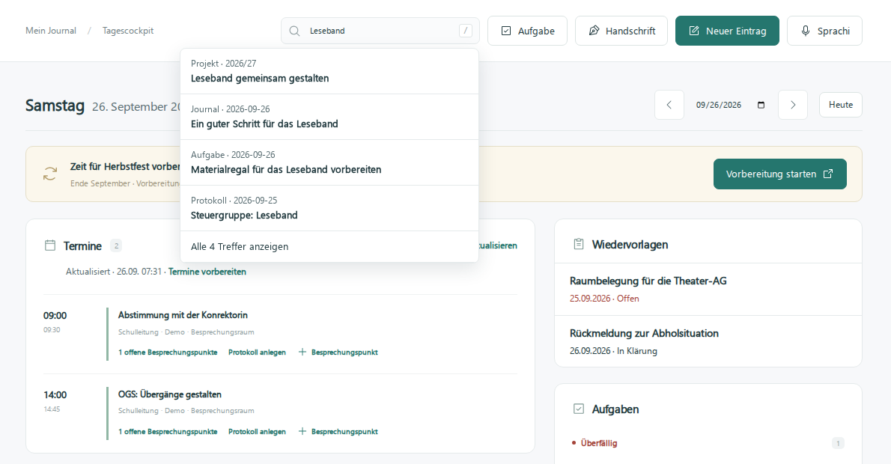

*Die Suche führt direkt zu unterschiedlichen Arten von Ressourcen, die zum eingegebenen Begriff passen.*

## 12. Am Tagesende: Auch das Geschaffte sehen

Eine Aufgabenliste zeigt oft vor allem, was noch fehlt. Im Cockpit ergänzt **Heute geschafft** diese Perspektive. Dort erscheinen die an diesem Tag erledigten Aufgaben mit Häkchen und Anzahl.

Entscheidend ist der Zeitpunkt des Erledigens, nicht das ursprüngliche Fälligkeitsdatum. Auch eine schon länger offene Aufgabe zählt also zu dem Tag, an dem sie tatsächlich abgeschlossen wurde. Beim Blick auf einen früheren Tag zeigt das Journal entsprechend dessen erledigte Aufgaben.

Gerade an einem Tag mit vielen kleinen Unterbrechungen kann dieser Rückblick hilfreich sein: Die Rückmeldung ist verschickt, die Lesekisten sind bestellt, die Unterlagen sind sortiert. Zusammen mit einem kurzen Journaleintrag entsteht ein sichtbarer Abschluss des Arbeitstags.

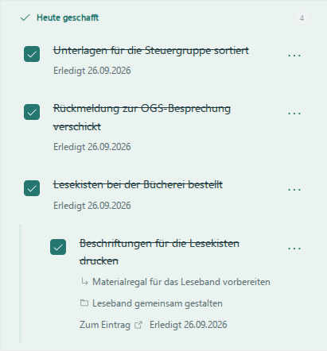

*Der Tagesrückblick macht erledigte Arbeit sichtbar – auch dann, wenn sie kein großes Projekt abgeschlossen hat.*

Für den längeren Rhythmus des Schuljahrs gibt es außerdem **Jahresprozesse**. Wiederkehrende Vorhaben können als Vorlagen mit Aufgaben festgehalten werden. Zum passenden Zeitraum erinnert das Journal an die Vorbereitung. So können Erfahrungen aus einem abgeschlossenen Fest oder einem organisatorischen Ablauf in die nächste Runde einfließen.

## 13. Ein eigener Arbeitsbereich mit Verantwortung für den Betrieb

SL-Journal wird selbst betrieben, beispielsweise lokal auf einem Rechner. Die Bedienung erfolgt im Browser. Für den Zugriff vom iPad oder einem anderen Gerät müssen Netzwerk und HTTPS passend eingerichtet sein; ein ausgeschalteter oder schlafender Rechner stellt die App nicht zuverlässig bereit.

Die Anmeldung verwendet Passwort und Authenticator-Code. Datenbank und Anhänge werden verschlüsselt gespeichert. Für Sicherungen gibt es eigene Verwaltungsbefehle; Löschfristen können je Eintragstyp hinterlegt werden. Automatische Abrufe und Wartung benötigen eine entsprechende Einrichtung. Ein bloßer manueller App-Start richtet noch keine regelmäßigen Sicherungen ein.

Für eine Grundschulleitung bedeutet das auch: Vor dem Einsatz mit echten Daten sollten Zuständigkeit für Betrieb und Sicherung, erlaubte Inhalte und schulische Vorgaben geklärt sein. Die vorhandenen Schutzfunktionen ersetzen diese Entscheidungen nicht. Die App ist ein persönlicher Arbeitsbereich und keine vollständige Schulverwaltungssoftware oder gemeinsame Mehrbenutzerplattform.

Für den Einstieg muss trotzdem nicht sofort jede Funktion eingerichtet werden. Ein überschaubarer erster Schritt ist, mit fiktiven Daten das Tagesjournal, einige Aufgaben und einen Vorgang auszuprobieren. Danach können Kontakte, Projekte und Besprechungsvorbereitung hinzukommen. Mail- und Nextcloud-Anbindung folgen, wenn sie für die eigene Arbeitsweise nützlich sind.

Das Projekt ist auf [GitHub unter Bingenberger/SL-Journal](https://github.com/Bingenberger/SL-Journal) verfügbar. Die Anleitungen für [Windows](INSTALLATION-WINDOWS.md) und [macOS](INSTALLATION-MACOS.md) beschreiben Installation, lokalen Betrieb, Autostart und LAN-Zugriff.

---

*Redaktioneller Stand: 26. September 2026. Grundlage sind der aktuelle Quellcode und die projektinterne Funktionsdokumentation. Alle Abbildungen wurden in einer getrennten Demo-Instanz erstellt; produktive Daten und Zugangsdaten sind nicht abgebildet. Die im Text beschriebene Nextcloud-Dateiauswahl wurde für diese Screenshots nicht mit einer echten Cloud verbunden.*
